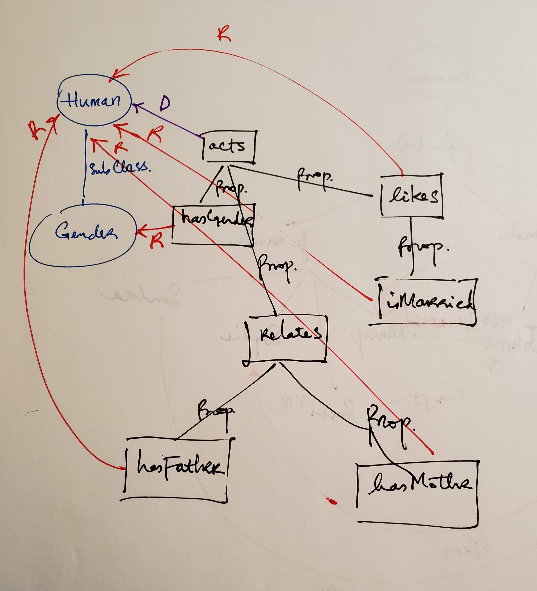
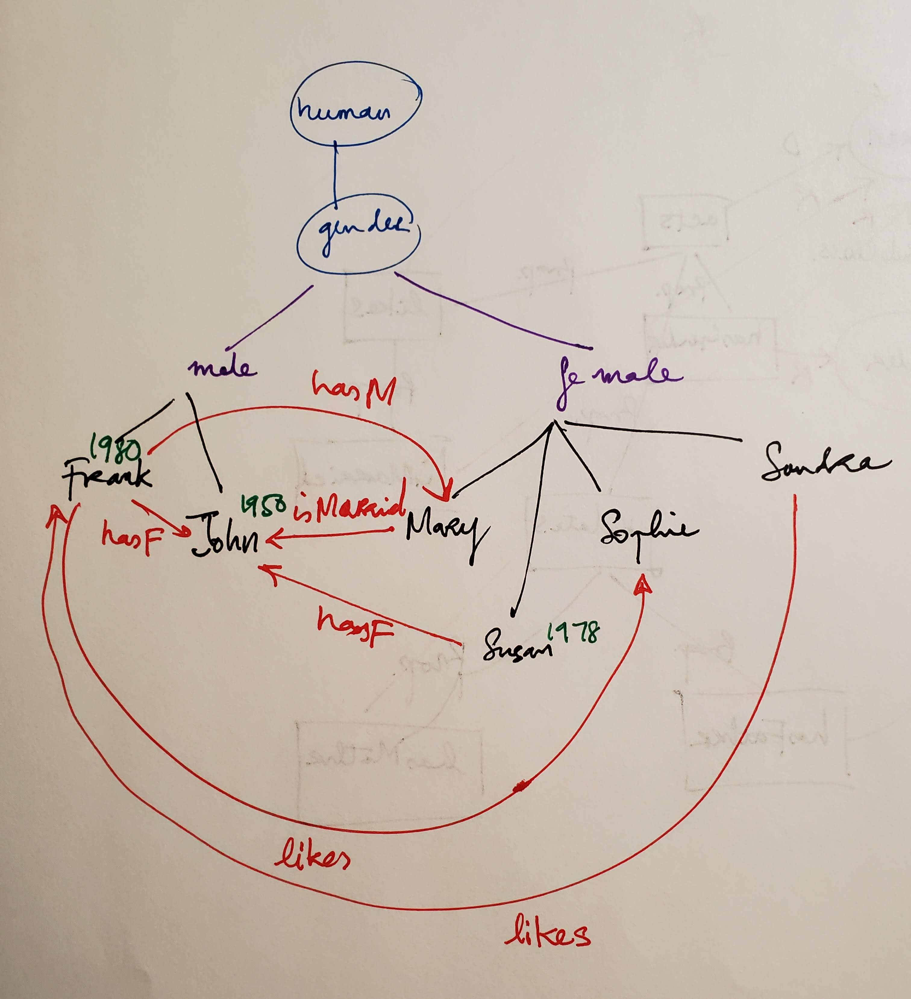
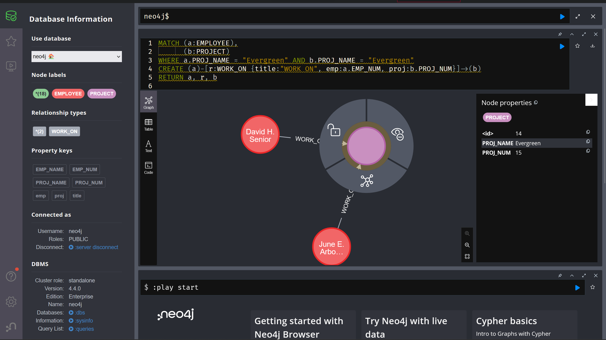

# 1. RDF

## a.

```xml
<rdf:rdf
    xmlns:rdf="http://www.w3.org/1999/02/22-rdf-syntax-ns#"
    xmlns:xsd="http://www.w3.org/2001/xmlschema#"
    >

    <!--a human with birthyear.-->
    <rdfs:class rdf:id="human" rdf:birthyear="&xs:year" />

    <!--a gender with alternative values.-->
    <rdfs:class rdf:id="gender">
        <rdfs:comment>
            the class of gender roles.
            all gender roles are humans.
        </rdfs:comment>
        <rdf:alt>
            <rdf:li rdf:resource="#male" />
            <rdf:li rdf:resource="#female" />
            <rdf:li rdf:resource="#non-binary" />
        </rdf:alt>
        <rdfs:subclassof rdf:resource="#human" />
    </rdfs:class>

    <!--root property: actions.-->
    <rdfs:property rdf:id="acts">
        <rdfs:domain rdf:resource="human" />
    </rdf:property>

    <!--has a gender.-->
    <rdf:property rdf:id="hasgender">
        <rdfs:range rdf:resource="#gender" />
        <rdfs:subpropertyof rdf:resource="acts" />
    </rdf:property>

    <!--likes another human.-->
    <rdf:property rdf:id="likes">
        <rdfs:range rdf:resource="#human" />
        <rdfs:subpropertyof rdf:resource="acts" />
    </rdf:property>

    <!--marries to another human.-->
    <rdf:property rdf:id="ismarried">
        <rdfs:range rdf:resource="#human" />
        <rdfs:subpropertyof rdf:resource="likes" />
    </rdf:property>

    <!--relates and by parental role.-->
    <rdf:property rdf:id="relates">
        <rdfs:range rdf:resource="#human" />
        <rdfs:subpropertyof rdf:resource="acts" />
    </rdf:property>

    <rdf:property rdf:id="hasfather">
        <rdfs:subpropertyof rdf:resource="relates" />
    </rdf:property>

    <rdf:property rdf:id="hasmother">
        <rdfs:subpropertyof rdf:resource="relates" />
    </rdf:property>

</rdf:rdf>
```


## b.

```xml
<rdf:RDF
    xmlns:rdf="http://www.w3.org/1999/02/22-rdf-syntax-ns#"
    xmlns:xsd="http://www.w3.org/2001/XMLSchema#"
    >

    <!--John-->
    <rdf:Description rdf:about="John" rdf:Class="human" rdf:BirthYear="1950">
        <hasGender rdf:resource="male" />
    </rdf:Description>

    <!--Mary-->
    <rdf:Description rdf:about="Mary" rdf:Class="human">
        <hasGender rdf:resource="female" />
        <isMarried rdf:resource="John" />
    </rdf:Description>

    
    <!--Sophie, Sandra, Susan-->
    <rdf:Bag rdf:Class="human" rdf:hasGender="female">
        <rdf:li>
            <rdf:Description rdf:about="Sophie" />
        </rdf:li>
        <rdf:li>
            <rdf:Description rdf:about="Sandra" rdf:likes="Frank" />
        </rdf:li>
        <rdf:li>
            <rdf:Description rdf:about="Susan" rdf:BirthYear="1978">
                <rdf:hasFather rdf:resource="John" />
            </rdf:Description>
        </rdf:li>
    </rdf:Bag>

    <!--Frank-->
    <rdf:Description rdf:about="John" rdf:Class="human" rdf:BirthYear="1980">
        <rdf:hasGender rdf:resource="male" />
        <rdf:hasFather rdf:resource="John" />
        <rdf:hasMother rdf:resource="Mary" />
        <rdf:likes rdf:resource="Sophie" />
    </rdf:Description>

</rdf:RDF>
```



# 2. Labeled Graph

Pseudocode to show which properties were selected for node classes `EMPLOYEE` and `PROJECT`:
```sql
FROM FILE Employee_Project* SELECT (EMP_NAME, EMP_NUM, PROJ_NAME) AS EMPLOYEE;
FROM FILE Employee_Project* SELECT (PROJ_NAME, PROJ_NUM) AS PROJECT;
```

Neoj4 AuraDB Query:
```sql
MATCH (a:EMPLOYEE),
      (b:PROJECT)
WHERE a.PROJ_NAME = "Evergreen" AND b.PROJ_NAME = "Evergreen"
CREATE (a)-[r:WORK_ON {title:"WORK ON", emp:a.EMP_NUM, proj:b.PROJ_NUM}]->(b)
RETURN a, r, b
```



# 3. Approximate Query Processing

## a. Give the Haar decomposition & draw corresponding errror tree
```txt
In: [127, 71, 87, 31, 59, 3, 43, 99, 100, 42, 0, 58, 30, 88, 72, 130]

Haar Decomposition:

Averages:
    [127, 71, 87, 31, 59, 3, 43, 99, 100, 42, 0, 58, 30, 88, 72, 130]
       \ /     \ /     \ /    \ /      \ /     \ /     \ /     \ /
3       99      59      31     71       71     29      59      101
           \  /            \  /            \  /           \  /
2           79              51              50             80
                 \      /                        \      /
1                   65                              65
                          \                    /
0                                   65

Detail Coeff.:
    [127, 71, 87, 31, 59, 3, 43, 99, 100, 42, 0, 58, 30, 88, 72, 130]
       \ /     \ /     \ /    \ /      \ /     \ /     \ /     \ /
3       28      28      28    -28       29    -29     -29      -29
           \  /            \  /            \  /           \  /
2            0              28              29              0
                 \      /                        \      /
1                   14                             14.5
                          \                    /
0                                   -0.25

Out:[65, -.25, 14, 14.5, 0, 28, 29, 0, 28, 28, 28, -28, 29, -29, -29, -29]

Drop the lower half:
Out:[65, -.25, 14, 14.5, 0, 28, 29, 0, 0, 0, 0, 0, 0, 0, 0, 0]

```

## b. Reconstructing the frequency during time interval $[15, 20]$

```txt
              65                                    |
              |                                     |
            -.25                                    |
           /     \                                  |
        14        14.5                              |
       /  \       /  \                              |
     0    28     29   0                             |
   0  0  0  0  0  0  0  0                           |
                                                    |
  -----15 20----------------------------------------

```

## c. Computing the total number of communications between $[15, 30]$ or $(3:6)_{1-indexed}$ or $(2:5)_{0-indexed}$ using Haar decomposition and error tree.

```txt
              65                                    | 0
              |                                     |
            -.25                                    | 1
          +/     \-                                 |
        14        14.5                              | 2
      +/  \-     +/  \-                             |
     0    28     29   0                             | 3
    /\    /\    /\    /\                            |
   0  1  2  3  4  5  6  7 . . .                     | (0-indexed)
   1  2  3  4  5  6  7  8 . . .                     | (1-indexed)
  ------15-20-25-30---------------------------------

```

$A(2:5)=180$
